# 🦦 Envoy — PostgreSQL Schema Management, Reimagined

<p align="center">
  
  <br/>
  <b>The permission‑aware database control plane your CI/CD pipeline ignores.</b>
</p>

> **CI/CD checks your code.**  
> **Envoy checks your permissions.**  
> **You need both.**

---

## Born From Pain

I was the only engineer at a startup.  
Every Friday at 10:00 AM was migration time.  
Every Friday at 10:15 AM was a permission failure.  
Every Friday at 10:30 AM was frantic `pgAdmin` surgery.

CI/CD didn’t care about permissions.  
My stakeholders didn’t understand databases.  
I was alone drowning in audit requests I couldn’t answer.

So I built **Envoy**, first to survive, then to scale.  
Now it’s yours.

---

## The Problem

Managing database migrations across **Staging → QA → Production** is a minefield.

| Problem | Reality |
|--------|---------|
| **Switching `.env` files** | Manual, dangerous, and easy to mess up. |
| **Forgetting GRANTs** | The classic “Permission Denied” outage. |
| **Audit logs** | Scattered, missing, or nonexistent. |
| **Multiple tools** | pgAdmin, psql, VS Code, CLI… pure chaos. |

### The “Friday 10 AM Anti‑Pattern”

1. Grab production credentials (already a red flag).  
2. Swap `.env` variables manually.  
3. Run migrations and pray.  
4. Realize you forgot permissions.  
5. Patch GRANTs live while users see errors.

There’s a better way.

---

## The Envoy Solution

Envoy sits between your ORM (Prisma, Gorm, Drizzle, etc.) and your infrastructure to give you a **unified, permission‑aware control plane**.

### What Envoy Gives You

- **One Interface:** Switch environments without touching config files.  
- **Permission Audits:** Automatic GRANT verification per environment; the blind spot CI/CD ignores.  
- **Immutable Audit History:** GitHub‑style logs for every executed query.  
- **Security First:** Encrypted secrets, strict audit trails, and zero credential juggling.

---

## Who Is Envoy For?

- **Founding Engineers:** You’re likely to be alone. You can’t afford 3 AM permission outages.  
- **DevOps Teams:** CI/CD deploys code, not permissions. Envoy fills the gap.  
- **Compliance‑Heavy Startups:** SOC2, HIPAA, GDPR; you need receipts. Envoy gives them.  
- **Solo Devs With PTSD:** If you’ve been paged for a forgotten GRANT… welcome home.

---

## Quick Start

### Prerequisites
- Docker & Docker Compose  
- Git  

---

### 1. Setup

```bash
git clone https://github.com/franciscoluna-28/envoy.git
cd envoy

docker-compose up -d
```
### 2. Services
| Service       | URL                                            |
| ------------- | ---------------------------------------------- |
| **Web Interface** | [http://localhost:5173](http://localhost:5173) |
| **API Server**    | [http://localhost:8080](http://localhost:8080) |
| **pgAdmin**       | [http://localhost:5050](http://localhost:5050) |

## Configuration
Copy the environment file and fill in the required keys:

```bash
cp server/.env.example server/.env
```

## Required Environment Variables

| Variable | Description | Example |
|----------|-------------|---------|
| `DATABASE_URL` | Envoy's internal database (SQLite) | `file:./data/envoy.db` |
| `JWT_SECRET` | Authentication secret | `your-secret-key` |
| `ENCRYPTION_KEY` | 32-character encryption key | `your-encryption-key-32-chars` |
| `CHECKSUM_KEY` | 32-character checksum key | `your-checksum-key-32-chars` |
| `PORT` | API server port | `8080` |
| `APP_ENV` | Environment mode | `development` |

## Example .env File

```
DATABASE_URL=file:./data/envoy.db
JWT_SECRET=your-jwt-secret-64-chars-ultra-secure-random-key
ENCRYPTION_KEY=your-encryption-key-32-chars-123
CHECKSUM_KEY=your-checksum-key-32-chars-12345
PORT=8080
APP_ENV=development
```

## How It Works

### Architecture


---

### Built With

| Layer | Technology |
|-------|------------|
| **Frontend** | React 19, Vite, TypeScript |
| **Backend** | Go 1.25, Gin |
| **Databases** | PostgreSQL (target), SQLite (internal) |
| **Infrastructure** | Docker, Docker Compose |

---

## Let's Build Something That Won't Break at 3am

I'm **Francisco Luna**. I architect backend systems for startups that want to skip the permission hell I lived through.

**What I offer:**
- Database architecture reviews
- Backend consulting (Go, Node.js, PostgreSQL)
- MVP development with production-ready foundations
- Infrastructure and architecture in AWS

**I've been the solo engineer. I've made the mistakes. Let me help you skip them.**

📧 **Email:** franciscolunadev@gmail.com  
📅 **Book a call:** [cal.com/franciscoluna](https://cal.com/franciscoluna)
